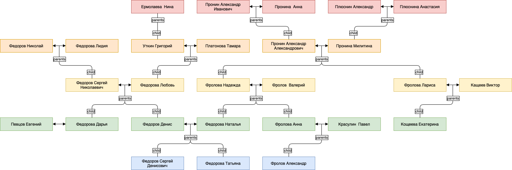

## Lab work #1

A genealogical tree implemented in `Prolog` language:

* **Entities**: 27 people
* **Dictionary**: 25 relations (49 expanded)
* **Functions** (*Rules*): 25 functions (14 dyadic + 10 unary)
